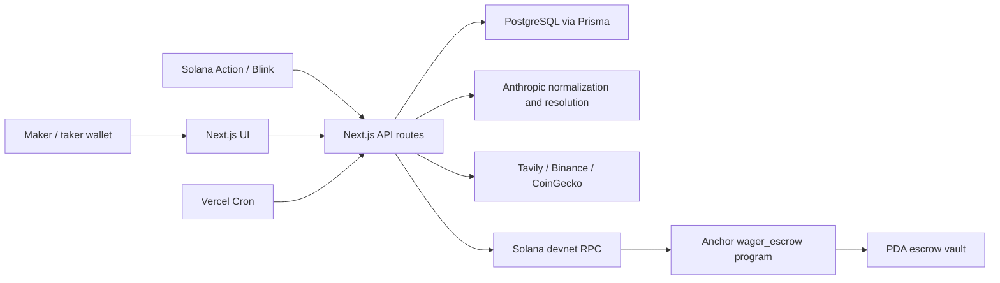

# Wager Architecture

Wager is an experimental P2P wager escrow built for Solana devnet. The
application coordinates an off-chain workflow in PostgreSQL while an Anchor
program owns the escrow and enforces payout state transitions on-chain.

This document describes the current implementation, including the boundaries
between the database and Solana. It is not a mainnet architecture claim.

## System context

## Component responsibilities

| Component | Responsibility | Source |
|---|---|---|
| Next.js API routes | Request handling, validation, fee calculation, transaction construction, admin and cron orchestration | `src/app/api/` |
| PostgreSQL / Prisma | Application workflow state, normalized conditions, evidence, disputes, transactions, rate-limit counters and admin logs | `prisma/schema.prisma` |
| Resolver adapters | Condition normalization, crypto data lookup, web research and evidence-backed result proposals | `src/lib/ai/`, `src/lib/web-search.ts`, `src/lib/price-snapshot.ts` |
| Solana integration | PDA derivation, account decoding, transaction builders and retry-aware settlement | `src/lib/solana/` |
| Anchor program | Escrow custody, status transitions, dispute timing, refunds and payout math | `programs/wager_escrow/` |
| Scheduled jobs | Resolution, DB/chain reconciliation, finalization, rate-limit cleanup and VIP evaluation | `src/app/api/cron/`, `vercel.json` |

## State ownership

Wager intentionally keeps different data in two systems:

- PostgreSQL stores the full application record: human-readable conditions,
  evidence rows, resolver confidence, application-level dispute records and
  operational logs.
- The Solana `BetAccount` stores the escrow-critical subset: parties, stake,
  deadlines, status, resolver authority, fee basis points, proposed/final
  winner and a 32-byte evidence hash.
- The vault PDA holds devnet SOL. A database status does not move funds.

PostgreSQL is therefore not an on-chain event projection. It is an application
state machine that is reconciled with the program by polling.

## Core flow

### 1. Normalize and create

`POST /api/bets/normalize` validates the request, asks Anthropic to turn free
text into an objective YES/NO condition, and applies additional ambiguity and
content guards. `POST /api/bets/create` validates the submitted normalized
payload, calculates the fee server-side, optionally records a crypto price
snapshot and creates the PostgreSQL bet.

The create endpoint does not repeat every normalization guard. Clients that
bypass the normal UI can submit their own normalized fields; this is documented
as a limitation rather than treated as a system-wide safety guarantee.

### 2. Fund the maker

The backend builds an unsigned transaction from database values. The maker
wallet signs the initialize and fund instructions. SOL is transferred to the
vault PDA; the backend never signs as the maker. The current `fund_maker`
instruction can be called repeatedly while the wager remains `Open`; the
program does not record a one-time funded flag or require an exact vault
balance. The application flow avoids this, but the invariant is not enforced
on-chain.

### 3. Accept

The Solana Action endpoint builds the taker transaction only after the database
records maker funding. The Anchor program checks the allowed taker, deadline,
stake and current status, then transfers the taker stake. It does not itself
verify that the vault already contains exactly one maker stake, so a directly
constructed transaction can accept an unfunded or overfunded wager. This is a
mainnet blocker.

### 4. Synchronize

The per-bet sync route and the scheduled reconciliation job decode the on-chain
account and update selected PostgreSQL fields. Reconciliation is eventual and
limited to database rows that are currently non-terminal.

### 5. Resolve and dispute

After the deadline, the resolver job gathers deterministic crypto data or web
evidence, optionally uses Anthropic, and stores the proposed winner, evidence
and SHA-256 hash in PostgreSQL. This starts a 24-hour application-level dispute
window. User disputes are also recorded in PostgreSQL.

The current flow does not publish the proposal on-chain at the start of that
window. This distinction is important: the application dispute window and the
Anchor program's dispute deadline are separate mechanisms.

The dispute API checks whether the supplied public key belongs to the maker or
taker, but it does not verify a wallet signature. A caller can therefore claim
a public participant address; signed dispute authorization is a mainnet
requirement.

### 6. Finalize

After the application window, the finalize job calls `settleOnChain()`:

1. read the current Anchor account status;
2. if needed, submit `propose_result` with the evidence hash;
3. if needed, submit `dispute_result` with the resolver authority;
4. submit `admin_finalize_disputed`;
5. confirm the transaction and verify that the vault is empty;
6. only then mark the PostgreSQL row `FINALIZED`.

The function resumes from `Accepted`, `ResultProposed` or `Disputed`, and an
already-finalized account is treated as a successful no-op. This makes the
path retry-aware and prevents duplicate payout through the program's status
checks. It is not a general exactly-once API: there is no external idempotency
key, and the already-finalized path does not independently verify the requested
winner or drained-vault postcondition before PostgreSQL is updated.

A retry found in `ResultProposed` always attempts the on-chain dispute
instruction. If the program dispute deadline has already elapsed, that retry
has no fallback to the natural permissionless finalize instruction and can
remain stuck until an operator intervenes.

The resolver-authority dispute in this sequence bypasses the natural on-chain
window. The current design is centralized and is a mainnet blocker; see
[`docs/KNOWN_LIMITATIONS.md`](docs/KNOWN_LIMITATIONS.md).

### 7. Refund

The Anchor program exposes a timeout-based refund instruction. The current API
route named `refund-onchain`, however, records `REFUNDED` in PostgreSQL and
reports the remaining vault balance without sending that instruction. A funded
vault still requires a later on-chain refund or maker cancellation. The route
name must not be interpreted as an atomic refund guarantee. In particular, the
route accepts database `RESULT_PROPOSED`, while the Anchor refund instruction
accepts only `Open`, `Accepted` or `Disputed`; a proposal already published
on-chain needs a different reviewed transition before funds can move.

## Scheduled jobs

| Schedule (UTC) | Route | Scope |
|---|---|---|
| Daily 00:00 | `/api/cron/resolve` | Resolve eligible bets, up to three attempts |
| Daily 00:30 | `/api/cron/reconcile` | Poll non-terminal DB rows against Solana |
| Daily 01:00 | `/api/cron/finalize` | Settle eligible undisputed proposals |
| Daily 02:00 | `/api/cron/cleanup` | Remove expired rate-limit counters |
| Sunday 03:00 | `/api/cron/vip-check` | Recalculate automatic VIP eligibility |

Cron routes accept a `CRON_SECRET` bearer token or the shared admin key. A
separate cron secret is recommended.

## Consistency and failure handling

- Newly submitted settlement transactions are confirmed before the database is
  finalized.
- A zero vault balance is checked after a newly submitted payout. The
  already-finalized recovery path does not repeat that check.
- Scheduled reconciliation repairs selected status, taker and maker-funding
  fields for non-terminal records. It corrects early workflow state and adopts
  terminal chain truth without regressing newer application-only
  proposal/dispute state.
- Reconciliation does not consume program events, repair terminal rows, recover
  transaction signatures or independently decode the final winner.
- The PostgreSQL fixed-window limiter uses an atomic upsert. It deliberately
  fails open during a database outage and protects only create and normalize.

## Trust boundaries

- Maker and taker wallets are untrusted transaction signers.
- The Next.js frontend is untrusted; escrow rules must be enforced by the API
  and Anchor program.
- The resolver authority is a single backend keypair with privileged on-chain
  powers.
- Admin authentication is a shared API secret rather than per-user identity.
- Anthropic, Tavily, Binance and CoinGecko responses are external inputs.
- Evidence content remains off-chain; only its hash is committed to Solana.

The full self-assessment and mainnet blockers are documented in
[`SECURITY_REVIEW.md`](SECURITY_REVIEW.md).
