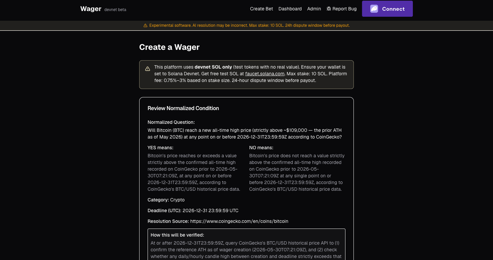
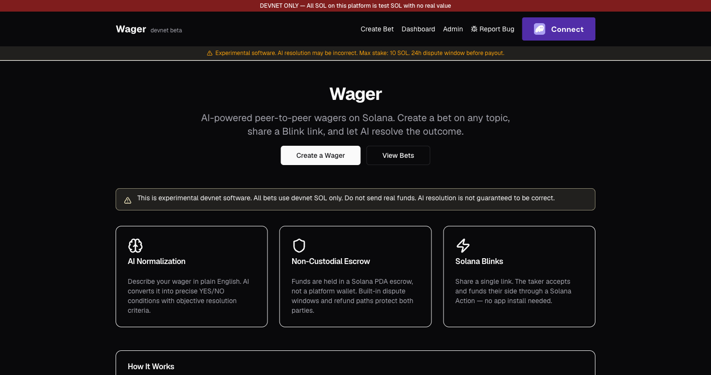

# Wager — AI-Powered P2P Bet Escrow on Solana

> **⚠️ Experimental devnet software. Do not use real funds. Not mainnet-ready.**

Universal AI-powered peer-to-peer wager escrow on Solana devnet. Users create bets in
natural language, an AI normalizes them into a precise YES/NO condition, funds go into a
PDA escrow, the counterparty accepts via Blink or wallet, an AI resolver determines the
outcome with evidence, and an auto-finalize cron settles the on-chain payout.

- **Live (devnet):** https://wager-smoky.vercel.app
- **Program:** `7fQ9Dh4iNrp2mfjtBthqrmrcYZXhSaCVZcyXVuCs6hFN`
- **Resolver authority:** `2K8jv4HT8Er7fSTEtJ3yAzqUJoQ6eLiRPYxYW9KTmECa`
- **Status:** Private beta (devnet only)

## Screenshots

| Create a bet in plain English → AI normalizes it into a precise, sourced market |
|:--:|
|  |

| Landing | Resolved bet — evidence + on-chain hash |
|:--:|:--:|
|  |  |

## Architecture

```
Frontend (Next.js) → API Routes → Prisma / PostgreSQL (Neon)
                                 → Anthropic Claude (normalize · resolve · adversarial challenger)
                                 → Tavily web search (evidence)
                                 → Binance / CoinGecko (price snapshots)
                                 → Solana devnet (PDA escrow)
                                 → Solana Actions / Blinks (taker acceptance)
```

## Tech Stack

- **Frontend:** Next.js 16, TypeScript, Tailwind CSS, shadcn/ui, Solana wallet adapter (Phantom/Solflare)
- **Backend:** Next.js API routes, Prisma ORM, PostgreSQL (Neon)
- **AI:** Anthropic Claude — Sonnet for resolution, Haiku for adversarial verification
- **Evidence:** Tavily web search (advanced depth), Binance/CoinGecko price snapshots
- **Blockchain:** Solana devnet, Anchor 0.30.1 program, PDA escrow, Solana Actions/Blinks
- **Hosting:** Vercel (5 scheduled crons)

## Core Flow

1. **Create** — describe a bet in natural language (`/create`)
2. **Normalize** — AI converts it to a precise YES/NO condition; rejects ambiguous/unfalsifiable wagers
3. **Fund** — maker deposits stake into the PDA escrow
4. **Share** — copy the Blink URL to a counterparty
5. **Accept** — taker deposits a matching stake (Blink or wallet)
6. **Resolve** — after the deadline, the resolver gathers evidence and proposes a winner
7. **Dispute window** — 24h for either party (or the resolver) to dispute
8. **Finalize** — undisputed bets auto-settle on-chain; disputed ones go to admin review

## Fees

| Category | Stake | Fee |
|----------|-------|-----|
| Crypto | < 5 SOL / ≥ 5 SOL | 1% / 0.75% |
| Non-crypto | < 0.25 / 0.25–0.99 / 1–4.99 / ≥ 5 SOL | 3% / 2% / 1% / 0.75% |
| VIP | any | 0.5% flat |

Fees are computed server-side (client values ignored). Non-crypto has a $0.20 USD floor.
VIP is auto-promoted by volume (10+ finalized bets or 50+ SOL) via a weekly cron.

## Resolution Pipeline

```
deterministic (crypto/sports API) → direct finalize (0.99 confidence)
non-deterministic → AI resolve (Sonnet) → confidence:
   < 0.80      → manual review
   0.80–0.93   → adversarial challenge (Haiku) → disagrees → manual review
                                                → agrees    → proceed
   > 0.93      → proceed
after dispute window → auto-finalize cron
```

The adversarial challenger uses a different model family (Haiku vs Sonnet) to reduce
correlated failures and checks for wording ambiguity, edge cases, evidence gaps, and
timeline attacks.

## Prerequisites

- Node.js 20+
- PostgreSQL database
- Anthropic API key (and Tavily API key for web-search evidence)
- Solana CLI + Anchor + Rust toolchain (only to build/deploy the on-chain program — see `TOOLCHAIN.md`)

## Quick Start

```bash
npm install
cp .env.example .env       # fill in the values below
npx prisma db push         # create the schema
npm run dev                # http://localhost:3000
```

### Environment variables

```
DATABASE_URL, ANTHROPIC_API_KEY, TAVILY_API_KEY,
WAGER_PROGRAM_ID, RESOLVER_AUTHORITY_PRIVATE_KEY, FEE_WALLET,
ADMIN_API_KEY, CRON_SECRET,
NEXT_PUBLIC_SOLANA_RPC_URL, NEXT_PUBLIC_APP_URL, NEXT_PUBLIC_BUG_REPORT_URL
```

## Scripts

```bash
npm run dev          # dev server
npm run build        # production build (~26 routes)
npm test             # vitest suite (296 tests, incl. a bankrun on-chain test)
npm run typecheck    # tsc --noEmit
npm run lint         # eslint
npm run generate:idl # regenerate IDL from source (anchor build IDL is broken on 0.30.1)
npm run db:studio    # Prisma Studio
```

### Building & deploying the Solana program

```bash
bash scripts/pin-deps.sh
cargo-build-sbf --manifest-path programs/wager_escrow/Cargo.toml --sbf-out-dir target/deploy
solana program deploy target/deploy/wager_escrow.so \
  --program-id target/deploy/wager_escrow-keypair.json --url devnet
```

See `TOOLCHAIN.md` for why the IDL is generated deterministically.

## On-Chain Program (9 instructions)

| Instruction | Purpose |
|-------------|---------|
| `initialize_bet` | Create the bet PDA |
| `fund_maker` | Maker deposits stake into the vault PDA |
| `accept_bet` | Taker deposits a matching stake |
| `cancel_unaccepted_bet` | Maker cancels an unfilled bet |
| `propose_result` | Resolver proposes a winner + evidence hash |
| `dispute_result` | Maker, taker, or resolver disputes within the window |
| `finalize_result_after_dispute_window` | Auto-finalize undisputed bets |
| `admin_finalize_disputed` | Admin settles a disputed bet |
| `refund_if_expired_or_unresolved` | 50/50 (or full) refund after a 7-day timeout |

Tiered fees, 24h dispute window, 10 SOL max stake, checked arithmetic, PDA `invoke_signed`
transfers. Settlement is on-chain first; the DB is marked `FINALIZED` only after the vault
is verified empty. `settleOnChain()` is the single idempotent path for all transitions.

## Key API Routes

| Method | Route | Description |
|--------|-------|-------------|
| POST | `/api/bets/normalize` | AI normalize (rate limited) |
| POST | `/api/bets/create` | Create bet + price snapshot + fee calc (rate limited) |
| GET  | `/api/bets` · `/api/bets/:id` | List / detail |
| POST | `/api/bets/:id/fund-maker/tx` | Build init+fund transaction |
| POST | `/api/bets/:id/sync` | Sync DB from on-chain state |
| POST | `/api/bets/:id/dispute` | File a dispute |
| GET/POST | `/api/actions/bet/:id[/accept]` | Blink metadata / accept transaction |
| POST | `/api/admin/bets/:id/finalize-onchain` | Full on-chain settlement |
| POST | `/api/admin/bets/:id/refund-onchain` | Refund |
| POST | `/api/resolver/run[/:id]` | Run the resolver (admin) |
| GET  | `/api/health` | DB + RPC + resolver-key check |

> DB-only `finalize`/`refund` are intentionally disabled (HTTP 410) — settlement must go on-chain first.

## Cron Jobs (Vercel)

| Schedule (UTC) | Route | Purpose |
|----------------|-------|---------|
| `0 0 * * *` | `/api/cron/resolve` | AI-resolve bets past their deadline (3 retries) |
| `30 0 * * *` | `/api/cron/reconcile` | Reconcile DB ↔ chain for non-terminal bets |
| `0 1 * * *` | `/api/cron/finalize` | Auto-finalize undisputed bets past the dispute window |
| `0 2 * * *` | `/api/cron/cleanup` | Purge expired rate-limit counters |
| `0 3 * * 0` | `/api/cron/vip-check` | Auto-promote VIP wallets by volume |

## Safety Features

- Non-custodial PDA escrow; vault transfers via `invoke_signed`
- 24h dispute window + 7-day refund timeout
- SHA-256 evidence hash stored on-chain (canonicalized before hashing)
- Low-confidence / conflicting results flagged for manual review
- Adversarial AI challenger on borderline confidence
- Atomic fixed-window rate limiting (DB-backed)
- Server-side fee calculation; Zod validation at all boundaries
- Timing-safe admin auth; admin actions logged with before/after status
- Ambiguous, unfalsifiable, illegal, or unverifiable wagers rejected at normalize

## Project Structure

```
src/
├── app/
│   ├── api/              # route handlers (bets, actions, admin, resolver, cron, health)
│   ├── admin/ bet/[id]/ create/ dashboard/
├── components/           # React components (bet-detail split into info/evidence) + shadcn/ui
├── lib/
│   ├── ai/               # normalize + resolver (+ adversarial challenger)
│   ├── solana/           # program interaction, PDA derivation, tx builders,
│   │                     #   account-layout (shared parser), settle (idempotent)
│   ├── rate-limit.ts  fees.ts  price-snapshot.ts  validators.ts  utils.ts  db.ts
programs/wager_escrow/    # Anchor Solana program (Rust)
tests/                    # vitest suite (incl. tests/anchor/*.test.ts via bankrun)
prisma/                   # schema
```

## Documentation

| File | Topic |
|------|-------|
| `CLAUDE.md` | Architecture & conventions (source of truth) |
| `SECURITY_REVIEW.md` | Threat model, mainnet blockers |
| `TOOLCHAIN.md` | Deterministic IDL, edition2024 workaround |
| `HOSTED_BETA_REPORT.md` | Devnet tx signatures, settlement proof |
| `BETA_KNOWN_LIMITATIONS.md` | Known limitations |
| `DEMO_SCRIPT.md` | Demo walkthrough |

## Mainnet Blockers

Independent Anchor audit · multi-sig/oracle resolver (replace single authority) ·
admin authentication with per-user accounts/MFA · formal verification or fuzzing ·
legal review. See `SECURITY_REVIEW.md` for the full list.
