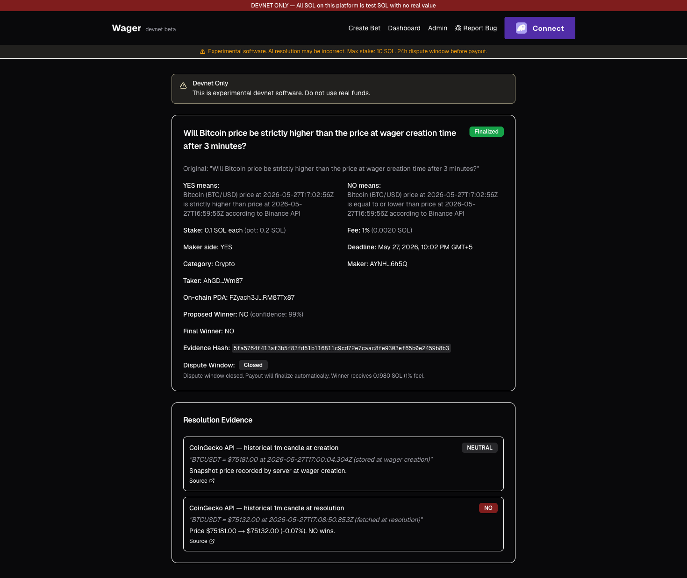
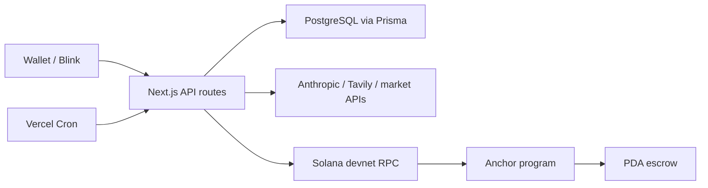

# Wager

Wager is a P2P wager escrow prototype on Solana devnet. A Next.js API and
PostgreSQL workflow coordinate transaction construction, external evidence,
scheduled resolution and DB/chain reconciliation; an Anchor program holds the
escrow and enforces payout state transitions.

AI-assisted condition normalization and evidence-based resolution are separate
components of the backend, not a decentralization or correctness guarantee.

## Status

- Experimental and unaudited.
- Solana devnet only.
- Not mainnet-ready.
- Do not use real funds or send mainnet SOL.
- No active hosted demo; the former Vercel deployment is offline.

## Demo

- Devnet program:
  [`7fQ9…hFN`](https://explorer.solana.com/address/7fQ9Dh4iNrp2mfjtBthqrmrcYZXhSaCVZcyXVuCs6hFN?cluster=devnet)
- Example finalized settlement:
  [`3TQ9…nwiT`](https://explorer.solana.com/tx/3TQ9QiCWir12rgFhyuEGQ4CvLtLMHe2v8JNMCmjBjYLumA1UxqQx6wYsnNnDPSGmMwpiRDASTyXjUiYZU9wVnwiT?cluster=devnet)
- Validation record: [`docs/DEVNET_VALIDATION.md`](docs/DEVNET_VALIDATION.md)

The program account and the example transaction were rechecked through the
public devnet RPC on 2026-07-14. Historical transaction proof does not establish
that the deployed binary exactly matches the current source.



Historical UI snapshot from May 2026; the screenshot is not proof of a current
deployment or of the source-to-program binary relationship.

## What it demonstrates

- REST-style API design with Next.js route handlers.
- PostgreSQL data modeling and atomic operations through Prisma.
- Server-side fee calculation and transaction construction.
- Integration with Solana RPC, an Anchor program and wallet-signed transactions.
- Coordination of off-chain workflow state with on-chain escrow state.
- Retry-aware settlement and duplicate-payout prevention.
- Scheduled resolution, finalization, reconciliation and maintenance jobs.
- External API adapters for market data, web evidence and model-assisted logic.
- Vercel deployment/cron configuration and a separate Anchor test image.
- Request/output validation, rate limiting and explicit error paths.
- Unit, integration, bankrun and local-validator test layers.

## Architecture



PostgreSQL owns the application workflow and evidence records. The Anchor
account owns escrow-critical state and the vault PDA owns devnet SOL. A polling
reconciliation job repairs selected non-terminal database fields from Solana.

See [`ARCHITECTURE.md`](ARCHITECTURE.md) for state ownership, trust boundaries
and the exact settlement sequence.

## Core flow

1. The maker submits free text for optional AI-assisted normalization into
   explicit YES/NO definitions and resolution criteria.
2. The create API validates the payload, snapshots supported crypto prices,
   calculates fees server-side and stores the PostgreSQL record.
3. The backend builds the expected initialize-and-fund transaction and the maker
   signs it; the stake moves to a PDA vault.
4. After the application observes maker funding, the taker signs an accept
   transaction through the application or a Solana Action/Blink. The program
   transfers the taker stake, but does not independently enforce an exact prior
   maker deposit; that on-chain invariant gap is a mainnet blocker.
5. After the deadline, the resolver gathers API/web evidence and stores a result
   proposal plus a SHA-256 evidence hash in PostgreSQL.
6. A 24-hour application-level dispute window runs. Disputes are recorded in
   PostgreSQL; this is distinct from the program's on-chain dispute deadline.
7. Eligible proposals are settled on-chain. For a newly executed finalization,
   PostgreSQL is marked `FINALIZED` only after transaction confirmation and an
   empty-vault check. The already-finalized retry path has narrower checks.

The current resolver is centralized and can use a privileged dispute/finalize
sequence. This is explicitly a mainnet blocker.

## Tech stack

- Next.js 16, React 19 and TypeScript.
- PostgreSQL with Prisma 5.
- Solana Web3.js, Solana Actions/Blinks and wallet adapters.
- Rust and Anchor 0.30.1.
- Anthropic SDK for normalization, resolution and a secondary challenge step.
- Tavily for web evidence; Binance and CoinGecko for supported price lookups.
- Vercel and five configured Vercel Cron schedules.
- Vitest, Solana Bankrun, Mocha and Chai.
- Tailwind CSS and Radix UI components.

## API

| Group | Representative endpoints | Responsibility |
|---|---|---|
| Bets | `GET /api/bets`, `GET /api/bets/:id`, `POST /api/bets/create` | Query and create application records |
| Normalization | `POST /api/bets/normalize` | Validate and normalize wager conditions |
| Transactions | `POST /api/bets/:id/fund-maker/tx`, `POST /api/actions/bet/:id/accept` | Build wallet-signed Solana transactions |
| Synchronization | `POST /api/bets/:id/sync` | Read selected program/vault state into PostgreSQL |
| Disputes | `POST /api/bets/:id/dispute` | Record a claimed-participant dispute in the application workflow |
| Resolver | `POST /api/resolver/run[/:id]`, `GET /api/resolver/evidence/:id` | Produce and inspect resolution evidence |
| Admin | `POST /api/admin/bets/:id/finalize-onchain` | Coordinate privileged final settlement |
| Operations | `/api/cron/*`, `GET /api/health` | Scheduled work and dependency health checks |

The route named `refund-onchain` currently records a database refund but does
not submit the Anchor refund instruction. It is documented as a known blocker,
not advertised as an atomic refund API. If the chain is already
`ResultProposed`, the program refund instruction cannot recover it directly.

## Reliability and security

- Fee tiers are recalculated by the create API; client `fee_bps` is ignored.
- Zod validates core normalize, create, dispute and finalize payloads and model
  outputs. Some transaction/sync inputs still use manual checks.
- Create and normalize use an atomic PostgreSQL fixed-window limiter keyed by IP
  and, for create, wallet. The limiter fails open during DB outages.
- Settlement re-reads on-chain state and resumes from accepted, proposed or
  disputed states. Program status checks prevent a duplicate payout, but this
  is a retry-aware flow rather than a general exactly-once API.
- Newly executed finalization updates PostgreSQL only after Solana confirmation
  and a drained-vault check. An already-finalized retry does not independently
  recheck the final winner or vault postcondition.
- On-demand and scheduled reconciliation poll status, taker and maker-funding
  drift. They correct early workflow state and adopt terminal chain truth
  without regressing newer application-only proposal/dispute state, but are not
  an event projection.
- Canonicalized evidence is committed to Solana as SHA-256; evidence content
  remains off-chain.
- Admin/cron comparisons are timing-safe, but authentication still relies on
  shared secrets and a single resolver key.
- The dispute route matches a supplied public key to a participant but does not
  verify wallet ownership with a signature. This is a mainnet blocker.
- The program is unaudited and has known on-chain invariant gaps that must be
  fixed before any mainnet consideration.

Read the full self-assessment in [`SECURITY_REVIEW.md`](SECURITY_REVIEW.md).

## Testing

Install the locked dependency graph, then run:

```bash
npm ci
npm run typecheck
npm run lint
npm test
npm run build
```

`npm test` covers backend utilities, validation, fee logic, mirrored resolver
rule expectations, transaction-encoding and IDL conventions, settlement
behavior and a bankrun program test. On 2026-07-14 the suite passed 301 tests in
23 files; the separate local-validator suite passed 20 tests. These counts are
a dated verification record, not a permanently fixed metric.

The Anchor local-validator suite needs the pinned Rust/Solana/Anchor toolchain:

```bash
cargo-build-sbf \
  --manifest-path programs/wager_escrow/Cargo.toml \
  --sbf-out-dir target/deploy -- --locked
COPYFILE_DISABLE=1 anchor test --skip-build
```

The devnet smoke test is deliberately separate because it submits network
transactions. See [`TOOLCHAIN.md`](TOOLCHAIN.md).

## Local development

Prerequisites: Node.js 22, npm 10 and PostgreSQL.

```bash
npm ci
cp .env.example .env
npm run db:generate
npm run db:push
npm run dev
```

Open `http://localhost:3000`. Populate the empty secret fields in `.env` only
for the integrations you intend to exercise. Never commit `.env` or a wallet
keypair.

Solana CLI, Rust and Anchor are required only for rebuilding or running the
local-validator/devnet program tests.

## Known limitations

- Single resolver authority and shared-key admin authentication.
- Application-level and on-chain dispute timing are not the same flow.
- Dispute requests are not authenticated with a wallet signature.
- The program does not enforce exact one-time maker funding before acceptance.
- The API refund path can diverge from a funded on-chain vault.
- Reconciliation is scheduled and partial rather than event-driven.
- Rate limiting is limited in scope and deliberately fail-open.
- Crypto resolution does not verify a historical price exactly at the deadline;
  sports/general events rely on web evidence and model evaluation.
- No committed Prisma migration history, independent program audit, production
  monitoring, legal review or active public deployment.

See [`docs/KNOWN_LIMITATIONS.md`](docs/KNOWN_LIMITATIONS.md) for the complete
code-backed list and mainnet blockers.

## Documentation

- [`ARCHITECTURE.md`](ARCHITECTURE.md) — components, state ownership and flows.
- [`SECURITY_REVIEW.md`](SECURITY_REVIEW.md) — threat model, findings and secret review.
- [`TOOLCHAIN.md`](TOOLCHAIN.md) — pinned build stack, IDL generation and tests.
- [`docs/DEVNET_VALIDATION.md`](docs/DEVNET_VALIDATION.md) — historical devnet transaction evidence.
- [`docs/KNOWN_LIMITATIONS.md`](docs/KNOWN_LIMITATIONS.md) — current limitations and mainnet blockers.

## License

[MIT](LICENSE)
